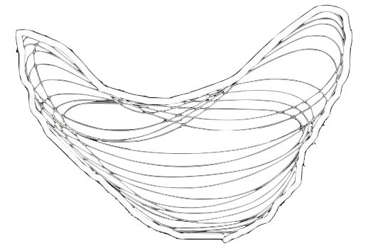
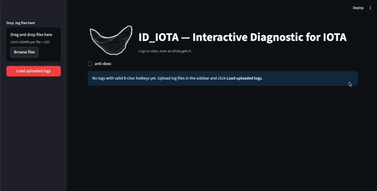

<div align="center">
  
  <div>
    <h1 style="margin:0;">ID_IOTA — Interactive Diagnostic for IOTA</h1>
    <p style="margin:6px 0 0 0;"><em>Logs so clear, even an idiota gets it.</em></p>
  </div>
</div>


ID\_IOTA is a Streamlit app that parses and visualizes large miner logs in-memory, showing backward passes, loss points, exceptions, and phase changes. It also generates a context-rich exceptions report with optional anti-doxx masking.

## Demo



---

## Quick start

### 1) Install dependencies

```bash
pip install -r requirements.txt
```

### 2) Run the app

```bash
streamlit run app.py
```

The app will open at [http://localhost:8501](http://localhost:8501).

### 3) ????

### 4) Profit

* Drag & drop your `.log` files into the sidebar and click **Load uploaded logs**.
* Explore **Backward passes**, **Loss**, and **Exceptions**; toggle **anti-doxx** if needed.
* Generate the **Exceptions text report** when you’re ready.

---

## Notes

* All parsing runs in-memory using SQLite; uploaded logs aren’t written to disk by the app.
* Designed for very large logs; report generation is optimized and can be triggered on demand, but uplaoding 5GB data will consume ~40 GB of RAM so be careful.
